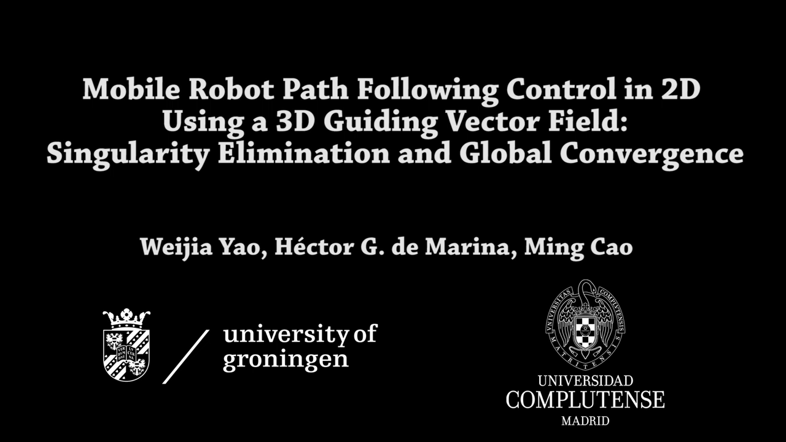

# Mobile Robot Path Following Control in 2D Using a 3D Guiding Vector Field
## Singularity Elimination and Global Convergence
Codes for CDC20

| File name    | Category            | Description                   |
| ------------ | ------------------- | ----------------------------- |
| pf_sim.slx   | path following      | Simulink file for simulation; |
| pf_plot.m    | path following      | Matlab file for plotting;     |
| pf_animate.m | path following      | Matlab file for animation;    |
| tt_sim.slx   | trajectory tracking | Simulink file for simulation; |
| tt_plot.m    | trajectory tracking | Matlab file for plotting;     |
| tt_animate.m | trajectory tracking | Matlab file for animation;    |

For convenience, you could directly download the data files from [here](https://drive.google.com/open?id=1bvGdsDeV_ZGX0BHK6cfYCEdCxeM6KAby), and use the "plot" or "animation" Matlab files above to see the effects. The details of the data files are shown below.

| Name             | Category            | Description                                      |
| ---------------- | ------------------- | ------------------------------------------------ |
| 11_noise0pf.mat  | path following      | without white noise                              |
| 11_noise10pf.mat | path following      | with white noise (power: 10, sampling time: 0.1) |
| 13_noise0tt.mat  | trajectory tracking | without white noise                              |
| 13_noise10tt.mat | trajectory tracking | with white noise (power: 10, sampling time: 0.1) |

The video can be accessed by clicking the image below:

